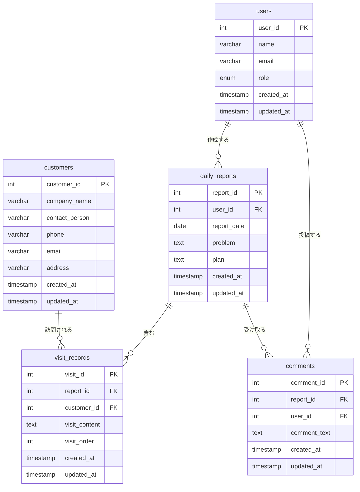

# 営業日報システム 要件定義書

## 1. システム概要

営業担当者が日々の顧客訪問活動を記録し、課題や計画を報告するシステム。
上長はこれらの報告を確認し、フィードバックをコメントとして提供できる。

## 2. 機能要件

### 2.1 日報作成機能
- 営業担当者は1日1件の日報を作成できる
- 日報には以下の項目を含む：
  - 報告日
  - 今日の課題や相談（Problem）
  - 明日やること（Plan）

### 2.2 顧客訪問記録機能
- 1つの日報に対して、複数の顧客訪問記録を追加できる
- 各訪問記録には以下の項目を含む：
  - 訪問した顧客（顧客マスタから選択）
  - 訪問内容

### 2.3 コメント機能
- 上長は日報に対してコメントを追加できる
- 1つの日報に複数のコメントを追加可能

### 2.4 マスタ管理機能
- **顧客マスタ**：顧客情報を管理
- **営業マスタ**：営業担当者の情報を管理

## 3. データ要件

### 3.1 エンティティ定義

#### users（営業マスタ）
| カラム名 | データ型 | 制約 | 説明 |
|---------|---------|------|------|
| user_id | INT | PK, AUTO_INCREMENT | ユーザーID |
| name | VARCHAR(100) | NOT NULL | 氏名 |
| email | VARCHAR(255) | NOT NULL, UNIQUE | メールアドレス |
| role | ENUM('staff', 'manager') | NOT NULL | 役割（一般営業/上長） |
| created_at | TIMESTAMP | DEFAULT CURRENT_TIMESTAMP | 作成日時 |
| updated_at | TIMESTAMP | DEFAULT CURRENT_TIMESTAMP ON UPDATE CURRENT_TIMESTAMP | 更新日時 |

#### customers（顧客マスタ）
| カラム名 | データ型 | 制約 | 説明 |
|---------|---------|------|------|
| customer_id | INT | PK, AUTO_INCREMENT | 顧客ID |
| company_name | VARCHAR(255) | NOT NULL | 会社名 |
| contact_person | VARCHAR(100) | | 担当者名 |
| phone | VARCHAR(20) | | 電話番号 |
| email | VARCHAR(255) | | メールアドレス |
| address | VARCHAR(500) | | 住所 |
| created_at | TIMESTAMP | DEFAULT CURRENT_TIMESTAMP | 作成日時 |
| updated_at | TIMESTAMP | DEFAULT CURRENT_TIMESTAMP ON UPDATE CURRENT_TIMESTAMP | 更新日時 |

#### daily_reports（日報）
| カラム名 | データ型 | 制約 | 説明 |
|---------|---------|------|------|
| report_id | INT | PK, AUTO_INCREMENT | 日報ID |
| user_id | INT | FK, NOT NULL | 営業担当者ID |
| report_date | DATE | NOT NULL | 報告日 |
| problem | TEXT | | 今日の課題や相談 |
| plan | TEXT | | 明日やること |
| created_at | TIMESTAMP | DEFAULT CURRENT_TIMESTAMP | 作成日時 |
| updated_at | TIMESTAMP | DEFAULT CURRENT_TIMESTAMP ON UPDATE CURRENT_TIMESTAMP | 更新日時 |

**制約:**
- UNIQUE(user_id, report_date)：同じ日に同じユーザーが複数の日報を作成できない

#### visit_records（訪問記録）
| カラム名 | データ型 | 制約 | 説明 |
|---------|---------|------|------|
| visit_id | INT | PK, AUTO_INCREMENT | 訪問記録ID |
| report_id | INT | FK, NOT NULL | 日報ID |
| customer_id | INT | FK, NOT NULL | 顧客ID |
| visit_content | TEXT | NOT NULL | 訪問内容 |
| visit_order | INT | NOT NULL | 訪問順序 |
| created_at | TIMESTAMP | DEFAULT CURRENT_TIMESTAMP | 作成日時 |
| updated_at | TIMESTAMP | DEFAULT CURRENT_TIMESTAMP ON UPDATE CURRENT_TIMESTAMP | 更新日時 |

#### comments（コメント）
| カラム名 | データ型 | 制約 | 説明 |
|---------|---------|------|------|
| comment_id | INT | PK, AUTO_INCREMENT | コメントID |
| report_id | INT | FK, NOT NULL | 日報ID |
| user_id | INT | FK, NOT NULL | コメント投稿者ID（上長） |
| comment_text | TEXT | NOT NULL | コメント内容 |
| created_at | TIMESTAMP | DEFAULT CURRENT_TIMESTAMP | 作成日時 |
| updated_at | TIMESTAMP | DEFAULT CURRENT_TIMESTAMP ON UPDATE CURRENT_TIMESTAMP | 更新日時 |

## 4. ER図

## 5. リレーションシップ詳細

### 5.1 users - daily_reports
- **関係**: 1対多
- **説明**: 1人の営業担当者は複数の日報を作成できる
- **外部キー**: daily_reports.user_id → users.user_id

### 5.2 daily_reports - visit_records
- **関係**: 1対多
- **説明**: 1つの日報には複数の顧客訪問記録を含むことができる
- **外部キー**: visit_records.report_id → daily_reports.report_id
- **削除時動作**: CASCADE（日報が削除されたら訪問記録も削除）

### 5.3 customers - visit_records
- **関係**: 1対多
- **説明**: 1つの顧客は複数の訪問記録を持つことができる
- **外部キー**: visit_records.customer_id → customers.customer_id

### 5.4 daily_reports - comments
- **関係**: 1対多
- **説明**: 1つの日報には複数のコメントを付けることができる
- **外部キー**: comments.report_id → daily_reports.report_id
- **削除時動作**: CASCADE（日報が削除されたらコメントも削除）

### 5.5 users - comments
- **関係**: 1対多
- **説明**: 1人の上長は複数のコメントを投稿できる
- **外部キー**: comments.user_id → users.user_id

## 6. 補足事項

### 6.1 権限管理
- 一般営業（role='staff'）：自分の日報の作成・編集のみ可能
- 上長（role='manager'）：全ての日報の閲覧とコメント投稿が可能

### 6.2 データ整合性
- 日報の重複防止：同じユーザーが同じ日付で複数の日報を作成できないようにUNIQUE制約を設定
- 訪問順序：visit_orderフィールドで1日の訪問の順序を管理

### 6.3 将来的な拡張性
- 訪問記録に訪問時間（開始・終了）を追加
- 日報の承認フロー機能
- 月次・週次レポート集計機能
- 顧客訪問の統計・分析機能
