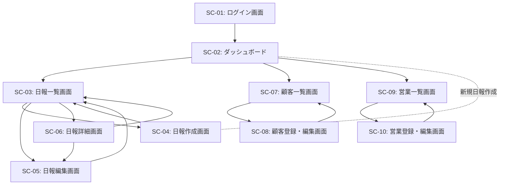

# 営業日報システム 画面定義書

## 1. 画面一覧

| 画面ID | 画面名 | アクセス権限 | 説明 |
|--------|--------|-------------|------|
| SC-01 | ログイン画面 | 全ユーザー | システムにログインする |
| SC-02 | ダッシュボード | 全ユーザー | ホーム画面・各機能へのナビゲーション |
| SC-03 | 日報一覧画面 | 全ユーザー | 日報の一覧を表示 |
| SC-04 | 日報作成画面 | 一般営業 | 新規日報を作成 |
| SC-05 | 日報編集画面 | 一般営業 | 既存の日報を編集 |
| SC-06 | 日報詳細画面 | 全ユーザー | 日報の詳細を表示・コメント投稿 |
| SC-07 | 顧客一覧画面 | 全ユーザー | 顧客マスタの一覧を表示 |
| SC-08 | 顧客登録・編集画面 | 全ユーザー | 顧客マスタの登録・編集 |
| SC-09 | 営業一覧画面 | 上長 | 営業マスタの一覧を表示 |
| SC-10 | 営業登録・編集画面 | 上長 | 営業マスタの登録・編集 |

---

## 2. 画面詳細定義

### SC-01: ログイン画面

#### 概要
システムにログインするための認証画面

#### アクセス権限
- 全ユーザー（未認証）

#### 画面項目

| 項目名 | 項目ID | 入力形式 | 必須 | バリデーション | 備考 |
|--------|--------|----------|------|---------------|------|
| メールアドレス | email | テキスト入力 | ○ | メール形式 | |
| パスワード | password | パスワード入力 | ○ | 8文字以上 | |
| ログインボタン | btn_login | ボタン | - | - | |

#### 画面操作
1. メールアドレスとパスワードを入力
2. ログインボタンをクリック
3. 認証成功 → ダッシュボード（SC-02）へ遷移
4. 認証失敗 → エラーメッセージを表示

---

### SC-02: ダッシュボード

#### 概要
ログイン後のホーム画面。主要機能へのナビゲーションと概要情報を表示

#### アクセス権限
- 全ユーザー（認証済み）

#### 画面項目

| 項目名 | 項目ID | 表示内容 | 備考 |
|--------|--------|----------|------|
| ユーザー名表示 | user_name | ログインユーザー名 | ヘッダー部 |
| 今日の日報ステータス | today_status | 未作成/作成済 | 一般営業のみ |
| 日報一覧リンク | link_reports | - | |
| 顧客一覧リンク | link_customers | - | |
| 営業一覧リンク | link_users | - | 上長のみ表示 |
| 新規日報作成ボタン | btn_new_report | - | 一般営業のみ、今日の日報が未作成の場合 |

#### 画面操作
- 各リンクをクリックして対応画面へ遷移

---

### SC-03: 日報一覧画面

#### 概要
日報の一覧を表示。ユーザー、期間で絞り込み可能

#### アクセス権限
- 一般営業：自分の日報のみ閲覧可能
- 上長：全ての日報を閲覧可能

#### 画面項目

##### 検索条件部
| 項目名 | 項目ID | 入力形式 | 必須 | 備考 |
|--------|--------|----------|------|------|
| 営業担当者 | filter_user | ドロップダウン | - | 上長のみ表示 |
| 報告日（開始） | filter_date_from | 日付入力 | - | |
| 報告日（終了） | filter_date_to | 日付入力 | - | |
| 検索ボタン | btn_search | ボタン | - | |

##### 一覧表示部
| 項目名 | 項目ID | 表示内容 | 備考 |
|--------|--------|----------|------|
| 報告日 | report_date | YYYY/MM/DD形式 | ソート可能 |
| 営業担当者 | user_name | 営業担当者名 | 上長のみ表示 |
| 訪問件数 | visit_count | 訪問記録の件数 | |
| コメント数 | comment_count | コメントの件数 | |
| 詳細ボタン | btn_detail | ボタン | クリックで日報詳細画面へ |

##### アクション部
| 項目名 | 項目ID | 表示条件 | 備考 |
|--------|--------|----------|------|
| 新規作成ボタン | btn_create | 一般営業のみ | 日報作成画面へ |

#### 画面操作
1. 検索条件を入力して検索ボタンをクリック → 条件に合致する日報を表示
2. 詳細ボタンをクリック → 日報詳細画面（SC-06）へ遷移
3. 新規作成ボタンをクリック → 日報作成画面（SC-04）へ遷移

---

### SC-04: 日報作成画面

#### 概要
新規日報を作成する画面

#### アクセス権限
- 一般営業のみ

#### 画面項目

##### 基本情報
| 項目名 | 項目ID | 入力形式 | 必須 | バリデーション | 備考 |
|--------|--------|----------|------|---------------|------|
| 報告日 | report_date | 日付入力 | ○ | - | デフォルトは今日 |
| Problem（課題・相談） | problem | テキストエリア | - | 最大5000文字 | |
| Plan（明日やること） | plan | テキストエリア | - | 最大5000文字 | |

##### 訪問記録（動的追加可能）
| 項目名 | 項目ID | 入力形式 | 必須 | バリデーション | 備考 |
|--------|--------|----------|------|---------------|------|
| 顧客 | customer_id | ドロップダウン | ○ | - | 顧客マスタから選択 |
| 訪問内容 | visit_content | テキストエリア | ○ | 最大2000文字 | |
| 追加ボタン | btn_add_visit | ボタン | - | - | 新しい訪問記録行を追加 |
| 削除ボタン | btn_remove_visit | ボタン | - | - | 該当行を削除 |

##### アクション部
| 項目名 | 項目ID | 備考 |
|--------|--------|------|
| 保存ボタン | btn_save | 日報を保存して一覧画面へ |
| キャンセルボタン | btn_cancel | 入力内容を破棄して一覧画面へ |

#### 画面操作
1. 報告日、Problem、Planを入力
2. 訪問記録を1件以上追加
   - 顧客を選択し、訪問内容を入力
   - 追加ボタンで訪問記録を追加可能
   - 削除ボタンで不要な行を削除可能
3. 保存ボタンをクリック → バリデーションチェック後、保存して日報一覧画面へ
4. キャンセルボタンをクリック → 確認ダイアログ後、日報一覧画面へ

#### バリデーション
- 報告日は必須
- 訪問記録が0件の場合はエラー
- 同じ報告日で既に日報が存在する場合はエラー

---

### SC-05: 日報編集画面

#### 概要
既存の日報を編集する画面

#### アクセス権限
- 一般営業：自分の日報のみ編集可能
- 作成日から7日以内のみ編集可能（業務ルール）

#### 画面項目
日報作成画面（SC-04）と同様

#### 画面操作
日報作成画面（SC-04）と同様

#### 補足
- 報告日は変更不可（表示のみ）
- 既存の訪問記録を編集・削除・追加が可能

---

### SC-06: 日報詳細画面

#### 概要
日報の詳細を表示し、上長がコメントを投稿できる画面

#### アクセス権限
- 一般営業：自分の日報のみ閲覧可能
- 上長：全ての日報を閲覧・コメント可能

#### 画面項目

##### 基本情報（表示のみ）
| 項目名 | 項目ID | 表示内容 |
|--------|--------|----------|
| 報告日 | report_date | YYYY/MM/DD形式 |
| 営業担当者 | user_name | 作成者名 |
| Problem | problem | 課題・相談内容 |
| Plan | plan | 明日やること |

##### 訪問記録一覧（表示のみ）
| 項目名 | 項目ID | 表示内容 |
|--------|--------|----------|
| 順序 | visit_order | 訪問順序（1, 2, 3...） |
| 顧客名 | company_name | 訪問先顧客名 |
| 訪問内容 | visit_content | 訪問内容 |

##### コメント一覧
| 項目名 | 項目ID | 表示内容 |
|--------|--------|----------|
| 投稿者 | commenter_name | コメント投稿者名 |
| 投稿日時 | created_at | YYYY/MM/DD HH:MM形式 |
| コメント内容 | comment_text | コメント本文 |

##### コメント投稿部（上長のみ表示）
| 項目名 | 項目ID | 入力形式 | 必須 | バリデーション |
|--------|--------|----------|------|---------------|
| コメント | comment_text | テキストエリア | ○ | 最大2000文字 |
| 投稿ボタン | btn_post_comment | ボタン | - | - |

##### アクション部
| 項目名 | 項目ID | 表示条件 | 備考 |
|--------|--------|----------|------|
| 編集ボタン | btn_edit | 一般営業、自分の日報、7日以内 | 日報編集画面へ |
| 削除ボタン | btn_delete | 一般営業、自分の日報、7日以内 | 確認後削除 |
| 戻るボタン | btn_back | 全ユーザー | 日報一覧画面へ |

#### 画面操作
1. 日報の内容と訪問記録を閲覧
2. コメント一覧を閲覧
3. （上長のみ）コメントを入力して投稿ボタンをクリック → コメントを保存して画面を再表示
4. 編集ボタンをクリック → 日報編集画面（SC-05）へ遷移
5. 削除ボタンをクリック → 確認ダイアログ後、削除して日報一覧画面へ
6. 戻るボタンをクリック → 日報一覧画面へ

---

### SC-07: 顧客一覧画面

#### 概要
顧客マスタの一覧を表示

#### アクセス権限
- 全ユーザー

#### 画面項目

##### 検索条件部
| 項目名 | 項目ID | 入力形式 | 必須 | 備考 |
|--------|--------|----------|------|------|
| 会社名 | filter_company_name | テキスト入力 | - | 部分一致検索 |
| 検索ボタン | btn_search | ボタン | - | |

##### 一覧表示部
| 項目名 | 項目ID | 表示内容 | 備考 |
|--------|--------|----------|------|
| 会社名 | company_name | 会社名 | ソート可能 |
| 担当者名 | contact_person | 担当者名 | |
| 電話番号 | phone | 電話番号 | |
| メールアドレス | email | メールアドレス | |
| 編集ボタン | btn_edit | ボタン | 編集画面へ |
| 削除ボタン | btn_delete | ボタン | 確認後削除 |

##### アクション部
| 項目名 | 項目ID | 備考 |
|--------|--------|------|
| 新規登録ボタン | btn_create | 顧客登録画面へ |

#### 画面操作
1. 検索条件を入力して検索ボタンをクリック → 条件に合致する顧客を表示
2. 編集ボタンをクリック → 顧客編集画面（SC-08）へ遷移
3. 削除ボタンをクリック → 確認ダイアログ後、削除
4. 新規登録ボタンをクリック → 顧客登録画面（SC-08）へ遷移

---

### SC-08: 顧客登録・編集画面

#### 概要
顧客マスタの新規登録・編集を行う画面

#### アクセス権限
- 全ユーザー

#### 画面項目

| 項目名 | 項目ID | 入力形式 | 必須 | バリデーション | 備考 |
|--------|--------|----------|------|---------------|------|
| 会社名 | company_name | テキスト入力 | ○ | 最大255文字 | |
| 担当者名 | contact_person | テキスト入力 | - | 最大100文字 | |
| 電話番号 | phone | テキスト入力 | - | 電話番号形式 | |
| メールアドレス | email | テキスト入力 | - | メール形式 | |
| 住所 | address | テキストエリア | - | 最大500文字 | |
| 保存ボタン | btn_save | ボタン | - | - | |
| キャンセルボタン | btn_cancel | ボタン | - | - | |

#### 画面操作
1. 各項目を入力
2. 保存ボタンをクリック → バリデーションチェック後、保存して顧客一覧画面へ
3. キャンセルボタンをクリック → 確認ダイアログ後、顧客一覧画面へ

---

### SC-09: 営業一覧画面

#### 概要
営業マスタの一覧を表示

#### アクセス権限
- 上長のみ

#### 画面項目

##### 一覧表示部
| 項目名 | 項目ID | 表示内容 | 備考 |
|--------|--------|----------|------|
| 氏名 | name | 営業担当者名 | ソート可能 |
| メールアドレス | email | メールアドレス | |
| 役割 | role | 一般営業/上長 | |
| 編集ボタン | btn_edit | ボタン | 編集画面へ |
| 削除ボタン | btn_delete | ボタン | 確認後削除 |

##### アクション部
| 項目名 | 項目ID | 備考 |
|--------|--------|------|
| 新規登録ボタン | btn_create | 営業登録画面へ |

#### 画面操作
1. 編集ボタンをクリック → 営業編集画面（SC-10）へ遷移
2. 削除ボタンをクリック → 確認ダイアログ後、削除
3. 新規登録ボタンをクリック → 営業登録画面（SC-10）へ遷移

---

### SC-10: 営業登録・編集画面

#### 概要
営業マスタの新規登録・編集を行う画面

#### アクセス権限
- 上長のみ

#### 画面項目

| 項目名 | 項目ID | 入力形式 | 必須 | バリデーション | 備考 |
|--------|--------|----------|------|---------------|------|
| 氏名 | name | テキスト入力 | ○ | 最大100文字 | |
| メールアドレス | email | テキスト入力 | ○ | メール形式、重複不可 | |
| パスワード | password | パスワード入力 | ○ | 8文字以上 | 新規登録時のみ |
| 役割 | role | ラジオボタン | ○ | 一般営業/上長 | |
| 保存ボタン | btn_save | ボタン | - | - | |
| キャンセルボタン | btn_cancel | ボタン | - | - | |

#### 画面操作
1. 各項目を入力
2. 保存ボタンをクリック → バリデーションチェック後、保存して営業一覧画面へ
3. キャンセルボタンをクリック → 確認ダイアログ後、営業一覧画面へ

---

## 3. 画面遷移図

---

## 4. 共通仕様

### 4.1 ヘッダー
全画面共通で以下を表示
- システムロゴ/名称
- ログインユーザー名
- ログアウトボタン
- ナビゲーションメニュー

### 4.2 メッセージ表示
- 成功メッセージ：画面上部に緑色で表示（3秒後に自動で消える）
- エラーメッセージ：画面上部に赤色で表示（ユーザーが閉じるまで表示）
- 確認ダイアログ：削除など重要な操作時にモーダルで表示

### 4.3 ページング
一覧画面は1ページ20件表示でページング機能を提供

### 4.4 レスポンシブ対応
スマートフォン、タブレット、PCで適切に表示されるレスポンシブデザイン

### 4.5 操作ログ
全ての作成・更新・削除操作はログとして記録

---

## 5. 非機能要件

### 5.1 パフォーマンス
- 画面表示は3秒以内
- 検索結果表示は5秒以内

### 5.2 セキュリティ
- HTTPS通信
- XSS対策（入力値のエスケープ処理）
- CSRF対策（トークン検証）
- SQLインジェクション対策（プリペアドステートメント使用）

### 5.3 ブラウザ対応
- Chrome（最新版）
- Firefox（最新版）
- Safari（最新版）
- Edge（最新版）
